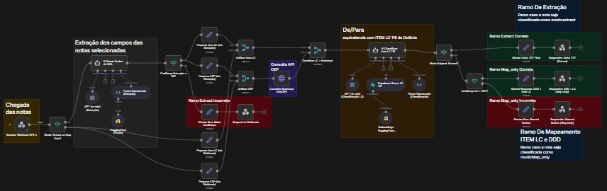
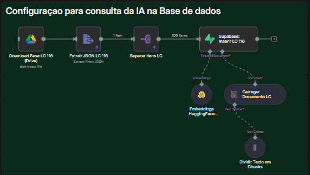

<p align="center">
  
</p>

<h1 align="center">ImportaREST GO</h1>

<p align="center">
  <strong>Importação inteligente de NFS-e para o sistema REST</strong><br>
  Processamento automatizado de XMLs fiscais com classificação de serviços por IA.
</p>

<p align="center">
  
  
  
  
</p>

---

## O Problema

Escritórios contábeis que utilizam o **sistema REST** precisam importar notas fiscais de serviço eletrônicas (NFS-e) manualmente — um processo repetitivo, demorado e propenso a erros. Cada município emite XMLs em formatos diferentes, os campos variam entre prefeituras, e a classificação do serviço (Item da Lista Complementar) exige conhecimento técnico-fiscal.

## A Solução

O **ImportaREST GO** automatiza todo o fluxo: lê os XMLs, extrai os dados fiscais, classifica o serviço usando inteligência artificial e gera o arquivo TXT pronto para importação no REST — em segundos.

---

## Funcionalidades

| Recurso | Descrição |
|---------|-----------|
| **Multi-padrão** | Compatível com XMLs nos padrões **ABRASF** e **Nacional** (NFS-e Nacional), cobrindo a grande maioria dos municípios brasileiros |
| **Classificação por IA** | Integração com pipeline N8N + LLM para identificar automaticamente o **Item LC** e **DDD** do serviço a partir da descrição |
| **Revisão manual assistida** | Quando a IA não atinge confiança suficiente, apresenta tela de revisão com os dados pré-preenchidos para validação humana |
| **Notas MEI** | Processamento específico para notas de Microempreendedor Individual (MEI) de Goiânia, com toggle na interface |
| **Separação por vigência** | Notas com data de emissão fora do mês selecionado são automaticamente separadas em arquivos TXT distintos |
| **Consulta IBGE** | Resolução automática do nome do município a partir do código IBGE via API oficial |
| **Detecção de cancelamentos** | Identifica e ignora automaticamente eventos de cancelamento presentes na pasta |
| **Relatório de processamento** | Gera relatório CSV detalhado com o status de cada nota (processada, erro, ignorada) e motivo |
| **Interface moderna** | GUI desktop com indicador de progresso circular, feedback em tempo real e fluxo intuitivo |

---

## Como Funciona

```
📂 Pasta de XMLs          ➜  📖 Leitura e parsing         ➜  🔍 Extração de dados
(ABRASF / Nacional)          (detecção automática)            (50+ campos fiscais)
                                                                      │
                                                                      ▼
📄 Arquivo TXT             ⬅  🧩 Montagem do TXT           ⬅  🤖 Classificação IA
(pronto para REST)             (cabeçalho + linhas)             (Item LC + DDD)
```

1. O usuário informa o **código da empresa** e a **vigência** (mês/ano)
2. O sistema localiza a pasta de XMLs correspondente no drive compartilhado
3. Cada XML é parseado, com detecção automática do padrão (ABRASF ou Nacional)
4. Os dados fiscais são extraídos: prestador, tomador, valores, impostos, descrição do serviço
5. A descrição é enviada ao pipeline de IA para classificação do serviço
6. O arquivo TXT é montado no formato exigido pelo sistema REST
7. O usuário salva o arquivo e importa diretamente no REST

---

## Stack Tecnológica

| Camada | Tecnologia |
|--------|-----------|
| **Linguagem** | Python 3.10+ |
| **Interface** | Tkinter + ttkbootstrap + Pillow |
| **Parsing XML** | xml.etree.ElementTree (stdlib) |
| **Orquestração IA** | N8N (workflow automation via webhook) |
| **LLM** | GPT-4o-mini (OpenAI) — extração e classificação fiscal |
| **Base Vetorial** | Supabase Vector Store + Embeddings HuggingFace |
| **APIs Externas** | ViaCEP (endereço) · IBGE Localidades (municípios) |
| **Relatórios** | CSV nativo |

---

## Arquitetura

```
importarest-go/
├── main.py                  # Entry point
├── config.py                # Configurações, paths e paleta de cores
├── core/                    # Lógica de negócio pura
│   ├── xml_parser.py        # Parsing XML e detecção de padrão
│   ├── extractor.py         # Extração de 50+ campos das NFS-e
│   ├── validators.py        # Validações e regras fiscais
│   ├── formatters.py        # Formatação de campos (data, UF, alíquota)
│   └── txt_builder.py       # Montagem das linhas do TXT de importação
├── services/                # Integrações externas
│   ├── ibge.py              # Consulta de municípios via API IBGE
│   ├── n8n_client.py        # Comunicação com webhook N8N (IA)
│   ├── processor.py         # Orquestrador do fluxo de processamento
│   └── report.py            # Geração de relatório CSV
├── ui/                      # Interface gráfica
│   ├── components.py        # Widgets reutilizáveis (botões, entries, progresso)
│   ├── dialogs.py           # Telas de preenchimento manual
│   └── app.py               # Janela principal e fluxo de interação
└── n8n/                     # Workflow de IA
    └── workflow.json        # Workflow N8N exportado (importável)
```

---

## Workflow N8N — Pipeline de IA

O cérebro do ImportaREST GO é um workflow N8N que recebe os dados das notas via webhook e retorna a classificação fiscal pronta. O pipeline opera em **dois modos** dependendo da completude dos dados extraídos localmente.

<p align="center">
  
  <br><em>Visão geral do workflow N8N</em>
</p>

### Modos de Operação

#### `extract` — Extração completa por IA
Usado quando o XML é de padrão desconhecido ou os dados extraídos localmente estão incompletos. A IA analisa o XML bruto e extrai **todos os campos fiscais** de uma vez.

```
Webhook ➜ IA Extrair Dados do XML (GPT-4o-mini) ➜ Confiança ≥ 85%?
  ✅ Sim ➜ Consulta ViaCEP ➜ IA Classificar Item LC 116 ➜ Monta linha TXT ➜ Responde
  ❌ Não ➜ Retorna manual_review para preenchimento humano
```

#### `map_only` — Apenas classificação do serviço
Usado quando o Python já extraiu todos os campos com sucesso e só precisa do **DDD** e **Item LC** (classificação do serviço na LC 116/2003).

```
Webhook ➜ Consulta ViaCEP ➜ IA Classificar Item LC 116 ➜ Confiança ≥ 75%?
  ✅ Sim ➜ Retorna DDD + Item LC + dados de endereço
  ❌ Não ➜ Retorna manual_review_map_only para revisão humana
```

### Nodes do Workflow

| Etapa | Node | Função |
|-------|------|--------|
| **Entrada** | `Receber Webhook NFS-e` | Recebe POST com XML e modo de operação |
| **Roteamento** | `Modo: Extract ou Map Only?` | Direciona para o ramo correto |
| **Extração IA** | `IA Extrair Dados do XML` | GPT-4o-mini analisa XML bruto e extrai 20+ campos fiscais |
| **Validação** | `Confiança Extração ≥ 85?` | Filtra extrações com baixa confiança |
| **Endereço** | `Consultar Endereço (ViaCEP)` | Enriquece dados com logradouro, bairro, cidade, UF e DDD |
| **Classificação** | `IA Classificar Item LC 116` | GPT-4o-mini + busca semântica no Supabase para encontrar o Item LC correto |
| **Saída Extract** | `Montar Linha TXT Final` | Monta a linha completa no formato `;` separado |
| **Saída Map Only** | `Montar Resposta: DDD + Item LC` | Retorna JSON com DDD, itemLC e dados de endereço |
| **Fallback** | `Montar Erro: Manual Review` | Sinaliza para o app abrir tela de preenchimento manual |

### Classificação de Serviços (LC 116/2003)

O node `IA Classificar Item LC 116` é o mais crítico do pipeline. Ele utiliza:

- **GPT-4o-mini** com temperature 0 para máxima precisão
- **Supabase Vector Store** com embeddings HuggingFace para busca semântica na base da LC 116
- **Lógica de 3 etapas**:
  1. Se a nota já traz um código LC, valida contra a base do Supabase
  2. Se não traz código, faz busca semântica pela descrição do serviço
  3. Se há conflito entre código e descrição, prioriza a descrição

### Configuração da Base de Dados

A base vetorial no Supabase é alimentada a partir de um JSON com todos os itens da LC 116/2003, processado pelo pipeline de ingestão:

<p align="center">
  
  <br><em>Pipeline de ingestão da base LC 116/2003 no Supabase</em>
</p>

```
Google Drive (JSON LC 116) ➜ Extrair JSON ➜ Separar Itens ➜ Embeddings HuggingFace ➜ Supabase Vector Store
```

### Importando o Workflow

O arquivo [`n8n/workflow.json`](n8n/workflow.json) pode ser importado diretamente no N8N:

1. Acesse seu N8N (cloud ou self-hosted)
2. Vá em **Workflows** → **Import from File**
3. Selecione `n8n/workflow.json`
4. Configure as credenciais:
   - **OpenAI** — API key para GPT-4o-mini
   - **Supabase** — URL e key do projeto
   - **HuggingFace** — API key para embeddings
   - **Google Drive** — OAuth2 (apenas para ingestão da base)
5. Ative o workflow

---

## Requisitos

- **Python 3.10** ou superior
- **Windows 10/11**
- Acesso ao drive compartilhado com os XMLs
- Dependências Python:

```bash
pip install ttkbootstrap Pillow requests
```

---

## Uso

```bash
python main.py
```

1. Insira o **código da empresa** cadastrada no REST
2. Insira a **vigência** no formato `MMYYYY` (ex: `012026` para janeiro/2026)
3. Marque **"Gerar notas MEI"** se desejar incluir notas de MEI de Goiânia
4. Clique em **INICIAR IMPORTAÇÃO**
5. Acompanhe o progresso em tempo real
6. Ao finalizar, clique em **BAIXAR TXT** e salve o arquivo
7. Importe o TXT no sistema REST

---

## Padrões de NFS-e Suportados

| Padrão | Cobertura | Identificação |
|--------|-----------|---------------|
| **ABRASF** | Maioria dos municípios brasileiros (São Paulo, BH, Curitiba, Goiânia, etc.) | Tags `CompNfse`, `InfNfse`, `Rps` |
| **Nacional** | Municípios migrados para o padrão NFS-e Nacional (Receita Federal) | Tags `NFSe`, `infNFSe`, `emit`, `trib` |

---

<p align="center">
  
  <br><br>
  <strong>Crosara Tech</strong><br>
  Tecnologia contábil que transforma rotina em resultado.
</p>
