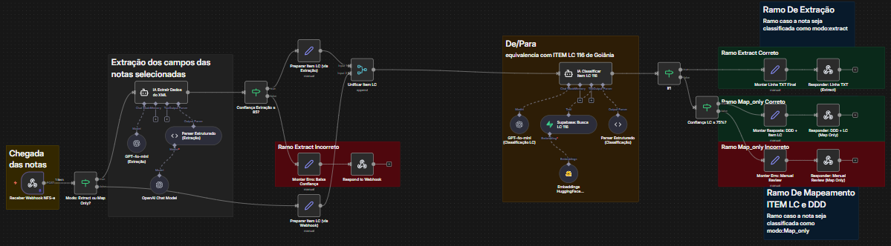
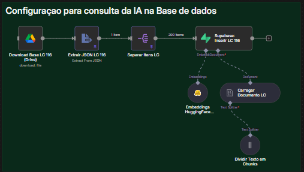

<p align="center">
  
</p>

<h1 align="center">ImportaREST GO</h1>

<p align="center">
  <strong>Importação inteligente de NFS-e para os portais ISS.NET e MegaSoft/DMSt-e</strong><br>
  Processamento automatizado de XMLs fiscais com classificação de serviços por IA para geração da Relação de Serviços de Terceiros (REST) e das declarações de serviços tomados para prefeituras que utilizam o <a href="https://www.iss.net">ISS.NET</a> ou o sistema MegaSoft.
</p>

<p align="center">
  
  
  
  
  
  
</p>

---

## O Problema

A **REST (Relação de Serviços de Terceiros)** e as declarações equivalentes (DMSt-e, MegaSoft) são documentos fiscais municipais obrigatórios, entregues mensalmente pelas contabilidades no portal da prefeitura. Registram a aquisição de serviços tomados de terceiros e o recolhimento do ISS retido.

Escritórios contábeis precisam importar dezenas ou centenas de notas fiscais de serviço eletrônicas (NFS-e) por empresa, por mês. Cada município emite XML em formato diferente, os campos variam, e a classificação do serviço (Item da Lista Complementar 116/2003) exige conhecimento técnico-fiscal.

## A Solução

O **ImportaREST GO** automatiza todo o fluxo:

1. Busca as NFS-e diretamente na **API da Autmais** (por CNPJ + vigência).
2. Extrai os dados fiscais (50+ campos) diretamente do XML.
3. Classifica o serviço com IA quando o dado não vem do XML (item LC 116, DDD, tributado no município).
4. Monta o arquivo TXT no formato exigido pelo portal da prefeitura.

Tudo isso em uma interface desktop pronta pra distribuição às analistas fiscais.

---

## Instalação (analistas fiscais)

> Precisa fazer isso **uma única vez por máquina**.

1. Baixe o instalador da última release:
   **[SetupImportaREST.exe](https://github.com/CrosaraTech/importarest-go/releases/latest/download/SetupImportaREST.exe)**
2. Execute (aceite o UAC — pede permissão de administrador).
3. Clique **Instalar**. O programa é instalado em `C:\ImportaREST\`.
4. Um atalho aparece automaticamente na Área de Trabalho.

### Atualizações

Nas próximas vezes que abrir o programa, ele **consulta o GitHub Releases** e, se houver versão nova, pergunta:

> **Nova versão disponível — Atualizar agora?**

Se você aceitar, o programa baixa em background, aplica o update em `C:\ImportaREST\`, preserva suas credenciais (`.env`), recria o atalho da desktop se tiver sido apagado e reinicia sozinho. **Sem UAC. Sem enviar zip pra ninguém.**

---

## Como funciona

```
🌐 API Autmais              ➜  📖 Parsing dos XMLs          ➜  🔍 Extração de dados
(NFS-e por CNPJ + mês)         (ABRASF / Nacional)              (50+ campos fiscais)
                                                                         │
                                                                         ▼
📄 Arquivo TXT              ⬅  🧩 Montagem do TXT           ⬅  🤖 Classificação IA (se necessário)
(ISS.NET ou MegaSoft)          (cabeçalho + linhas)             (Item LC 116 + DDD)
```

1. Analista informa o **código da empresa** (planilha) e a **vigência** (mês/ano).
2. Sistema consulta a **API Autmais** (`apimongo.autmais.com.br`) — union de emissões + updates da vigência.
3. Cada XML é parseado, com **detecção automática do padrão** (ABRASF ou NFS-e Nacional).
4. Campos fiscais são extraídos localmente (dado 100% da nota). Quando falta algum campo crítico, envia pro pipeline N8N.
5. Pipeline N8N (LLM + Supabase Vector Store) classifica o serviço na LC 116/2003.
6. TXT é montado no formato exigido pelo portal.
7. Analista salva o arquivo e importa no portal da prefeitura.

---

## Funcionalidades

| Recurso | Descrição |
|---------|-----------|
| **Auto-update** | Programa consulta GitHub Releases na abertura. Se houver versão nova, pergunta antes de aplicar. Update preserva `.env` e recria atalho. |
| **Instalador dedicado** | `SetupImportaREST.exe` pede UAC uma única vez, cria pasta, ajusta permissões (updates futuros sem UAC), embute credenciais e cria atalho. |
| **API Autmais** | Busca NFS-e por CNPJ + vigência, com filtro **UNION** de emissão + atualização (pega notas que apareceram por retificação). |
| **Multi-padrão** | Compatível com XMLs nos padrões **ABRASF 2.04** e **NFS-e Nacional (SPED)**. |
| **Multi-portal** | Aba **ISSNet** (Goiânia, Aparecida, Anápolis, Brasília) e aba **MegaSoft/DMSt-e** (Vianópolis, Crixás, Jussara). |
| **Classificação por IA** | Pipeline N8N + GPT-4o-mini identifica **Item LC** e **DDD** quando o XML não traz. |
| **Município correto** | `codigo_municipio` extraído do **prestador** (nunca do tomador ou local de prestação). Elimina bug de modelo/IM vazando para prestadores de fora do estado. |
| **Modelo TXT correto** | Modelo do TXT é decidido comparando o município do **prestador** com o município da **empresa tomadora** (via planilha, não Goiânia fixo). |
| **Revisão manual assistida** | Quando IA não bate confiança suficiente, tela de revisão com dados pré-preenchidos para validação humana. |
| **Grupo 99 (Sem incidência)** | Serviços LC grupo 99 (sem incidência ISSQN/ICMS) aceitos no fast-path Goiânia. |
| **Filtro de vigência** | Descarta notas emitidas mais de 1 mês antes do período (evita "lixo" da API por retificação). |
| **Notas MEI** | Processamento específico para notas de Microempreendedor Individual, com detecção automática. |
| **Consulta CEP e IBGE** | ViaCEP para endereço, IBGE Localidades para município a partir de código. Cache local. |
| **Detecção de cancelamentos** | Ignora automaticamente eventos de cancelamento presentes na resposta da API. |
| **Relatório de processamento** | CSV detalhado com status de cada nota (processada, erro, ignorada) e motivo. |
| **Processamento em lote** | Aba "Todas Analistas" processa múltiplas empresas de uma analista em sequência. |
| **Interface moderna** | GUI desktop dark, indicador de progresso circular, feedback em tempo real. |

---

## Stack Tecnológica

| Camada | Tecnologia |
|--------|-----------|
| **Linguagem** | Python 3.11+ |
| **Interface** | Tkinter + ttkbootstrap + customtkinter + Pillow |
| **Parsing XML** | xml.etree.ElementTree (stdlib) |
| **Secrets** | python-dotenv (`.env` fora do repo) |
| **Fonte NFS-e** | API Autmais (`api2.autmais.com.br`, `apimongo.autmais.com.br`) |
| **Orquestração IA** | N8N (webhook + workflows) |
| **LLM** | GPT-4o-mini (OpenAI) — extração e classificação fiscal |
| **Base Vetorial** | Supabase Vector Store + embeddings HuggingFace |
| **APIs externas** | ViaCEP · IBGE Localidades · CNPJ.ws |
| **Build/Distribuição** | PyInstaller (2 targets: app + installer) |
| **Auto-update** | GitHub Releases API + Python `urllib` + batch script Windows |

---

## Arquitetura

```
importarest-go/
├── main.py                          # Entry point (chama ui.app.JanelaCrosara)
├── config.py                        # Versão, GITHUB_REPO, INSTALL_DIR, credenciais (.env), paleta
├── config_web.py                    # Configuração da API FastAPI (backend web)
├── .env.example                     # Template de credenciais (nunca commite .env real)
├── build.spec                       # PyInstaller spec do app principal
├── installer.py                     # Fonte do SetupImportaREST.exe
├── installer.spec                   # PyInstaller spec do instalador (uac_admin, .env embutido)
│
├── core/                            # Lógica de negócio pura (sem I/O)
│   ├── xml_parser.py                # Parsing XML e detecção do padrão (ABRASF/Nacional)
│   ├── extractor.py                 # Extração de 50+ campos (municipio SÓ do prestador)
│   ├── validators.py                # Regras fiscais (item LC válido, eh_goiania, etc.)
│   ├── formatters.py                # Formatação (data, UF, alíquota, sanitização)
│   ├── txt_builder.py               # Montagem das linhas do TXT ISSNet e cabeçalho
│   ├── txt_validator.py             # Validação do TXT gerado antes do download
│   └── dmste_builder.py             # Montagem do TXT DMSt-e/MegaSoft
│
├── services/                        # Integrações externas e orquestração
│   ├── autmais_api.py               # Cliente REST da Autmais (auth 30 dias, notas, empresas, status)
│   ├── cep.py                       # ViaCEP com cache local
│   ├── cnpj.py                      # Consulta CNPJ (razão social, MEI)
│   ├── ibge.py                      # Consulta municípios via API IBGE
│   ├── n8n_client.py                # Comunicação com webhook N8N
│   ├── processor.py                 # Orquestrador do fluxo (fast-path, extract, map_only)
│   ├── batch_orchestrator.py        # Processamento em lote de várias empresas
│   ├── dmste_processor.py           # Processamento para portais MegaSoft
│   ├── report.py                    # Geração de relatório CSV
│   ├── spreadsheet.py               # Leitura da planilha de empresas (código → CNPJ, IM, município)
│   └── updater.py                   # Auto-update (GitHub Releases + updater.bat)
│
├── ui/                              # Interface gráfica
│   ├── app.py                       # Janela principal (versão, notebook, hook auto-update)
│   ├── all_analysts_panel.py        # Aba ISSNet (processamento por analista)
│   ├── dmste_panel.py               # Aba MegaSoft/DMSt-e
│   ├── batch_panel.py               # Painel de lote (várias empresas)
│   ├── components.py                # Widgets reutilizáveis (progresso circular, etc.)
│   ├── dialogs.py                   # Diálogos (item LC manual, cabeçalho)
│   └── editor_arquivo.py            # Editor de arquivo TXT gerado
│
├── api/                             # Backend FastAPI (fluxo web em construção)
├── tests/                           # 136 testes (pytest)
└── n8n/                             # Workflow N8N exportado + diagramas
    ├── workflow.json                # Workflow importável
    ├── workflow_completo.png        # Diagrama do pipeline principal
    └── workflow_config_base.png     # Diagrama do pipeline de ingestão da base LC 116
```

---

## Workflow N8N — Pipeline de IA

O cérebro do ImportaREST GO é um workflow N8N que recebe os dados das notas via webhook e retorna a classificação fiscal pronta. O pipeline opera em **dois modos** dependendo da completude dos dados extraídos localmente pelo Python.

<p align="center">
  
  <br><em>Pipeline completo: chegada, extração, De/Para e ramos de saída (Extract Correto/Incorreto, Map_only Correto/Incorreto)</em>
</p>

### Modos de operação

#### `extract` — Extração completa por IA
Usado quando o XML é de padrão desconhecido ou os dados extraídos localmente estão incompletos. A IA analisa o XML bruto e extrai todos os campos fiscais de uma vez.

```
Webhook ➜ IA Extrair Dados do XML (GPT-4o-mini) ➜ Confiança ≥ 85%?
  ✅ Sim ➜ Consulta ViaCEP ➜ IA Classificar Item LC 116 ➜ Monta linha TXT ➜ Responde
  ❌ Não ➜ Retorna manual_review para preenchimento humano
```

#### `map_only` — Apenas classificação do serviço
Usado quando o Python já extraiu todos os campos com sucesso e só precisa do **DDD** e **Item LC** (classificação do serviço na LC 116/2003).

```
Webhook ➜ Consulta ViaCEP ➜ IA Classificar Item LC 116 ➜ Confiança ≥ 75%?
  ✅ Sim ➜ Retorna DDD + Item LC + dados de endereço
  ❌ Não ➜ Retorna manual_review_map_only para revisão humana
```

### Nodes principais

| Etapa | Node | Função |
|-------|------|--------|
| **Entrada** | `Receber Webhook NFS-e` | Recebe POST com XML e modo (`extract` ou `map_only`) |
| **Roteamento** | `Modo: Extract ou Map Only?` | Direciona pro ramo correto |
| **Extração IA** | `IA Extrair Dados do XML` | GPT-4o-mini + Parser Estruturado extraem 20+ campos fiscais |
| **Validação** | `Confiança Extração ≥ 85?` | Filtra extrações com baixa confiança |
| **Unificação** | `Unificar Item LC` | Merge dos itens LC vindos da extração e do webhook |
| **De/Para** | `IA Classificar Item LC 116` | GPT-4o-mini + busca semântica (Supabase + embeddings HuggingFace) na base da LC 116 |
| **Ramo Extract Correto** | `Montar Linha TXT Final` | Linha completa no formato `;` separado |
| **Ramo Extract Incorreto** | `Montar Erro: Baixa Confiança` | Sinaliza revisão manual |
| **Ramo Map_only Correto** | `Montar Resposta: DDD + Item LC` | JSON com DDD, itemLC e endereço |
| **Ramo Map_only Incorreto** | `Montar Erro: Manual Review` | Sinaliza revisão manual (map only) |

### Classificação de Serviços (LC 116/2003)

O node `IA Classificar Item LC 116` é o mais crítico do pipeline. Utiliza:

- **GPT-4o-mini** com temperature 0 pra máxima precisão
- **Supabase Vector Store** com embeddings HuggingFace pra busca semântica na base da LC 116
- **Lógica de 3 etapas**:
  1. Se a nota já traz um código LC, valida contra a base do Supabase
  2. Se não traz código, busca semântica pela descrição do serviço
  3. Se há conflito entre código e descrição, prioriza a descrição

### Ingestão da base LC 116

A base vetorial no Supabase é alimentada a partir de um JSON com todos os itens da LC 116/2003:

<p align="center">
  
  <br><em>Pipeline de ingestão da base LC 116/2003 no Supabase</em>
</p>

```
Google Drive (JSON LC 116) ➜ Extrair JSON ➜ Separar Itens ➜ Embeddings HuggingFace ➜ Supabase Vector Store
```

### Importando o Workflow

O arquivo [`n8n/workflow.json`](n8n/workflow.json) pode ser importado direto no N8N:

1. Acesse seu N8N (cloud ou self-hosted)
2. Vá em **Workflows** → **Import from File** e selecione `n8n/workflow.json`
3. Configure as credenciais:
   - **OpenAI** — API key para GPT-4o-mini
   - **Supabase** — URL e key do projeto
   - **HuggingFace** — API key para embeddings
   - **Google Drive** — OAuth2 (apenas pra ingestão da base)
4. Ative o workflow

---

## Municípios suportados

### Aba ISSNet (portal ISS.NET)

| Município | IBGE | Observações |
|-----------|------|-------------|
| Goiânia | 5208707 | Fast-path com validação MEI |
| Aparecida de Goiânia | 5201405 | |
| Anápolis | 5201108 | |
| Brasília | 5300108 | |

### Aba MegaSoft/DMSt-e

- Vianópolis
- Crixás
- Jussara

> Precisa incluir mais um município? Adicione em [`config.py`](config.py) no dicionário `MUNICIPIOS_ACEITOS` — nome (com acento) → `ibge7`, `ibge6`, `ddd`. Sem essa entrada, `ibge_por_nome_municipio` retorna vazio e o comparador de modelo cai no fallback (Goiânia), gerando TXT errado.

---

## Desenvolvimento

### Requisitos

- **Python 3.12** ou superior (testado em 3.12.10)
- **Windows 10/11**
- Credenciais Autmais (login/senha do usuário de serviço)

### Setup

```bash
git clone https://github.com/CrosaraTech/importarest-go.git
cd importarest-go
python -m venv .venv
.venv\Scripts\activate
pip install -r requirements.txt -r requirements-dev.txt
```

As dependencias ficam em `requirements.txt` (execucao) e `requirements-dev.txt`
(testes e build), com versoes fixadas. Nao instale pacotes soltos: se a
lista sair de sincronia com o codigo, a suite passa a falhar por ambiente
e deixa de detectar regressao de verdade.


### Configuração

Copie `.env.example` para `.env` e preencha as credenciais:

```bash
copy .env.example .env
```

Edite `.env`:

```env
AUTMAIS_TENANT=seu-tenant-uuid-prefix
AUTMAIS_USERNAME=seu_usuario
AUTMAIS_PASSWORD=sua_senha
AUTMAIS_AUTH_HOST=https://api2.autmais.com.br/v1
AUTMAIS_NFSE_HOST=https://apimongo.autmais.com.br/v1
```

> **Nunca comite `.env`.** O `.gitignore` já exclui esse arquivo.

### Rodar em modo dev

```bash
python main.py
```

### Rodar os testes

```bash
pytest
```

Suite atual: **136 testes** — 128 passando e 8 pulados, cobrindo batch
orchestrator, review gate, extração, download endpoints e classify.

Os 8 pulados sao os de fidelidade byte a byte
(`tests/test_byte_fidelity.py`). Eles so rodam quando existirem arquivos de
referencia em `tests/fixtures/<municipio>/expected/` — um TXT e um CSV ja
aceitos pelo portal de cada municipio (goiania, aparecida, anapolis,
brasilia), junto dos XMLs que os geraram. Enquanto faltarem, a garantia de
que o TXT sai identico ao esperado nao tem cobertura automatica.

---

## Build e Release

### Build local

```powershell
# Aplicativo principal (dist/ImportaREST/ImportaREST.exe)
python -m PyInstaller build.spec --clean --noconfirm

# Instalador (dist/SetupImportaREST.exe, com .env embutido)
python -m PyInstaller installer.spec --clean --noconfirm

# Zip pra release
Compress-Archive -Path 'dist/ImportaREST' -DestinationPath 'dist/ImportaREST-vX.Y-windows.zip' -Force
```

### Publicar release

```powershell
# 1. Bump __version__ em config.py
# 2. Rebuild ambos os targets
# 3. Commit + push
git add config.py && git commit -m "chore: bump v1.15" && git push

# 4. Cria release no GitHub com ambos os assets
gh release create v1.15 `
  dist\ImportaREST-v1.15-windows.zip `
  dist\SetupImportaREST.exe `
  --repo CrosaraTech/importarest-go `
  --title "v1.15 - <resumo>" `
  --notes-file release_notes.md
```

Após publicar, o auto-updater de todas as instalações vai detectar a nova versão na próxima abertura e oferecer o update.

### Convenções de release

- **Tag**: `vX.Y` ou `vX.Y.Z` (usado como `tag_name` no `check_latest_release`).
- **Asset zip**: arquivo terminado em `.zip` com `windows` no nome — o updater filtra por esses tokens.
- **Asset installer**: `SetupImportaREST.exe`.

---

## Padrões de NFS-e suportados

| Padrão | Cobertura | Identificação |
|--------|-----------|---------------|
| **ABRASF 2.04** | Maioria dos municípios brasileiros | Tags `CompNfse`, `InfNfse`, `Rps`, `PrestadorServico`, `TomadorServico` |
| **NFS-e Nacional (SPED)** | Municípios migrados para o padrão nacional (Receita Federal) | Tags `NFSe`, `infNFSe`, `emit`, `toma`, `trib`, `cTribNac` |

---

## Segurança

- Credenciais Autmais **nunca** ficam no código-fonte — ficam em `.env` (excluído do repositório via `.gitignore`).
- O `SetupImportaREST.exe` embute o `.env` no momento do build via PyInstaller `--add-data`. O binário distribuído carrega as credenciais internamente; o repositório público não expõe nada.
- Se suspeitar de vazamento, rotacione a senha no portal Autmais, atualize `.env` local, rebuild o installer e faça `gh release upload v1.X dist\SetupImportaREST.exe --clobber` no release atual.

---

<p align="center">
  
  <br><br>
  <strong>Crosara Tech</strong><br>
  Tecnologia contábil que transforma rotina em resultado.
</p>
